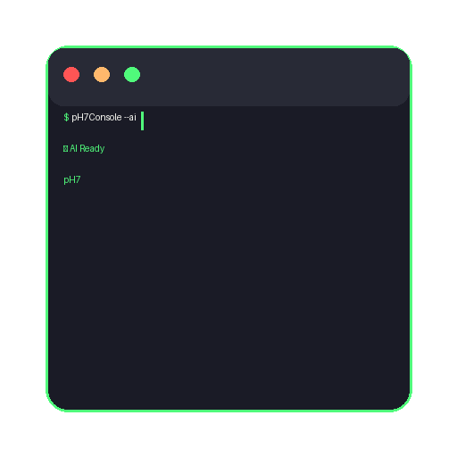

# pH7Console: AI-Powered Terminal Respecting Your Privacy



## Privacy-First AI-Powered Terminal with Advanced Built-In Local Machine Learning

pH7Console is a privacy-focused, ML-first terminal that brings the power of local AI and sophisticated machine learning to your command line experience. Built with Tauri for maximum performance and security.

## 🧠 Advanced AI & Machine Learning Features

- **Neural Pattern Recognition** - Advanced ML algorithms learn from your command patterns
- **Local LLM Processing** - Phi-3 Mini, Llama 3.2, TinyLlama, CodeQwen models
- **Natural Language Commands** - Convert plain English to shell commands
- **Context-Aware Memory** - Intelligent session and workflow context tracking
- **Smart Error Resolution** - AI-powered troubleshooting with learned solutions
- **Adaptive Learning Engine** - Continuously improves based on your usage patterns
- **Privacy-Preserving ML** - **All learning happens locally** with encrypted data storage

## Key Features

### 🤖 Advanced Local AI Intelligence
- **Neural Pattern Learning** - Sophisticated ML engine with gradient descent-like optimization
- **Command Classification** - Automatic categorization (FileManagement, GitOperation, Development, etc.)
- **Workflow Recognition** - Learns command sequences and suggests next steps
- **Context Memory** - Remembers successful contexts and adapts suggestions accordingly
- **Temporal Pattern Analysis** - Understands when you typically use certain commands
- **Smart Completions** - Context-aware command completions with confidence scoring
- **Natural Language Processing** - Convert plain English to shell commands  
- **Error Analysis & Fixes** - AI-powered error resolution with learning feedback

### 🧠 Machine Learning Engine
- **Feature Extraction** - Advanced context analysis (directory, file types, time, project structure)
- **Neural Patterns** - Local neural network-like structures for pattern recognition
- **Real-time Learning** - Continuous adaptation from every command execution
- **Session Workflow Tracking** - Builds understanding of your development workflows
- **Success Rate Optimization** - Learns from command success/failure patterns
- **User Analytics** - Detailed insights into your command usage and improvement areas

### 🔒 Privacy-First Architecture  
- **100% Local Processing** - No data leaves your machine
- **No Telemetry** - Your commands and data stay private
- **Encrypted Learning Data** - Local ML training data encrypted and secure
- **Local Model Storage** - All AI models stored and run locally

### ⚡ Performance Optimized
- **Lightweight Models** - Optimized for MacBook Air and similar hardware
- **Adaptive Loading** - Models load on-demand
- **Multi-Platform** - Native performance on macOS, Windows, Linux

### 🎯 Productivity Features
- **Multi-Session Management** - Multiple terminal sessions
- **Workflow Automation** - Smart command templates  
- **Session Recording** - Replay and analyze terminal sessions

### Utility

- `cargo fmt` (in src-tauri/) - Format Rust code
- `cargo clippy` (in src-tauri/) - Lint Rust code for common mistakes
- `npm run lint` - Check TypeScript/React code style
- `npm run type-check` - Verify TypeScript types

## How to Use

### Basic Usage

1. **Launch the app** - pH7Console opens with a dark terminal interface
2. **Natural language commands** - Type what you want in plain English:
   ```
   "show me all large files" 
   → AI suggests: find . -type f -size +100M -exec ls -lh {} \;
   ```
3. **Smart completions** - Start typing and press Tab for AI suggestions
4. **Error assistance** - When commands fail, AI automatically suggests fixes

### AI Features
- **Intelligent Command Prediction**: Machine learning engine suggests commands based on your patterns
- **Command Explanation**: Hover over any command for AI explanation
- **Error Recovery**: Automatic error analysis with learned solutions  
- **Context Awareness**: AI understands your project structure and working context
- **Workflow Learning**: Recognizes command sequences and optimizes your workflows
- **Adaptive Suggestions**: Confidence-scored suggestions that improve over time
- **Session Memory**: Remembers context within and across terminal sessions

## Technical Stack

- **Frontend**: React 18 + TypeScript + Tailwind CSS for styling
- **Backend**: Rust (Tauri 2.0) for native performance  
- **AI Runtime**: Candle ML framework (Rust-native)
- **Terminal**: Cross-platform PTY with xterm.js

### Local AI Models

pH7Console runs AI models locally using **Candle** (Rust's ML framework) for zero privacy concerns:

- **Phi-3 Mini (3.8GB)** - Best for command understanding
- **Llama 3.2 1B (1.2GB)** - Fastest responses on MacBook Air
- **TinyLlama (1.1GB)** - Minimal resource usage  
- **CodeQwen (1.5GB)** - Specialized for code tasks

## Contributing

Contributions are welcome! Please feel free to submit a Pull Request. For major changes, please open an issue first to discuss what you would like to change.

Please make sure to update tests as appropriate and follow the existing code style.

## Author

[](https://ph7.me "Pierre-Henry Soria, Software Developer")

Made with ❤️ by **[Pierre-Henry Soria](https://pierrehenry.be)**. A super passionate & enthusiastic Problem-Solver / Senior Software Engineer. Also a true cheese 🧀, ristretto ☕️, and dark chocolate lover! 😋

[](https://x.com/phenrysay "Follow Me on X")  [](https://github.com/pH-7 "My GitHub")  [](https://bsky.app/profile/ph7.me "Follow Me on BlueSky")  [](https://youtu.be/cWBuZ4DXGK4 "YouTube SucceedAI Video")

## License

Distributed under the MIT License. See [LICENSE](LICENSE) for more information.

**Unlike PyTorch training, pH7Console uses smart adaptation**:

```rust
// Example of how the system learns (in Rust)
pub struct UserPatternLearner {
    command_embeddings: LocalEmbeddingStore,
    context_analyzer: ContextAnalyzer,
    workflow_detector: WorkflowDetector,
}

impl UserPatternLearner {
    // Learns from command sequences
    pub fn analyze_command_sequence(&mut self, commands: &[Command]) {
        let patterns = self.workflow_detector.find_patterns(commands);
        self.store_workflow_template(patterns);
    }
    
    // Adapts suggestions based on context
    pub fn get_contextual_suggestions(&self, context: &Context) -> Vec<Suggestion> {
        let similar_contexts = self.find_similar_contexts(context);
        self.generate_suggestions(similar_contexts)
    }
}
```

**Learning Mechanisms**:

1. **Neural Pattern Recognition**
   - Advanced feature extraction from commands and context
   - Gradient descent-like optimization for pattern weights
   - Multi-dimensional similarity analysis for command matching
   - Confidence scoring based on usage frequency and success rates

2. **Context Understanding & Memory**
   - Project type detection (React, Rust, Python, etc.)
   - Working directory and file structure analysis  
   - Session-level context tracking and memory
   - Environmental context association (git repos, node projects, etc.)

3. **Workflow & Temporal Learning**
   - Command sequence pattern recognition
   - Session workflow analysis (e.g., git → test → deploy)
   - Temporal usage pattern learning (time-of-day preferences)
   - Workflow template creation for repeated tasks

4. **Error Pattern Learning & Recovery**
   - Contextual error analysis and classification
   - Success/failure pattern recognition
   - Learned solution suggestions based on past resolutions
   - Preventive error detection and warnings

5. **Adaptive Personalization Engine**
   - Command style preference learning
   - Suggestion confidence adaptation
   - Custom workflow optimization
   - User feedback integration for continuous improvement

**Privacy-Preserving Machine Learning**:
```rust
// All learning happens locally with sophisticated ML techniques
pub struct LearningEngine {
    // Neural pattern learning
    patterns: HashMap<String, NeuralPattern>,
    // Advanced context tracking
    session_workflows: HashMap<String, Vec<String>>,
    temporal_patterns: HashMap<String, Vec<DateTime<Utc>>>,
    context_memory: HashMap<String, f32>,
    // ML optimization
    learning_rate: f32,
    neural_weights: Vec<f32>,
}

impl LearningEngine {
    // Feature extraction with multiple dimensions
    fn extract_input_features(&self, input: &str, context: &str) -> Vec<f32> {
        // Command length, word count, type classification
        // Context features: directory, file types, git status, etc.
        // Temporal features: time of day, day of week
        // Environmental features: project type, tool presence
    }
    
    // Neural pattern learning with gradient descent
    fn update_patterns(&mut self, example: &LearningExample) {
        // Update weights based on success/failure
        // Confidence scoring with usage frequency
        // Similarity calculation with cosine distance
    }
}
```

**Machine Learning Analytics**:

The system provides detailed insights into your terminal usage patterns:

- **Success Rate Analysis** - Track command success rates and improvement over time
- **Most Used Commands** - Identify your most frequent commands and optimize them
- **Learning Progress** - See how many patterns the AI has learned from your usage
- **Workflow Efficiency** - Analyze command sequences for optimization opportunities
- **Context Performance** - Understand which contexts yield the highest success rates
- **Temporal Patterns** - Discover your productivity patterns throughout the day

**Real-time Learning Feedback**:

Every command execution contributes to the learning engine:
```rust
// Automatic learning from every command
pub async fn execute_command(command: &str) -> CommandResult {
    let result = shell_execute(command).await;
    
    // Learn from this execution
    learning_engine.learn_from_interaction(
        command,
        &result.output,
        &current_context,
        result.success,
        result.execution_time,
    ).await;
    
    // Track workflow patterns
    learning_engine.track_session_workflow(session_id, command);
    
    result
}

// No data ever leaves your machine
impl PrivacyPreservingLearner {
    pub fn learn_from_session(&mut self, session: &TerminalSession) {
        // Extract patterns without storing raw commands
        let patterns = self.extract_abstract_patterns(session);
        self.update_local_knowledge(patterns);
        // Raw commands are never stored or transmitted
    }
}
```

#### 🚀 Model Performance Comparison

| Model | Size | RAM Usage | Inference Speed | Best For |
|-------|------|-----------|-----------------|----------|
| **Phi-3 Mini** | 3.8GB | 4-6GB | 200-500ms | Complex reasoning, code generation |
| **Llama 3.2 1B** | 1.2GB | 2-3GB | 100-200ms | General commands, explanations |
| **TinyLlama** | 1.1GB | 1.5-2GB | 50-100ms | Real-time completions, quick suggestions |
| **CodeQwen** | 1.5GB | 2-4GB | 150-300ms | Programming tasks, code analysis |

#### 🔧 Model Loading and Optimization

**Adaptive Loading**:
```bash
# Models load based on task complexity
Simple completion → TinyLlama (fast)
Command explanation → Llama 3.2 (balanced)
Code generation → Phi-3 Mini (capable)
Error analysis → CodeQwen (specialized)
```

**Memory Optimization**:
- **Quantization**: 4-bit and 8-bit models reduce memory by 70%
- **Lazy Loading**: Models load only when needed
- **Memory Mapping**: Efficient model storage and access
- **Batch Processing**: Multiple requests processed together

**Battery Optimization**:
- **Power-aware inference**: Adjusts model complexity based on battery level
- **Thermal throttling**: Reduces inference rate if system gets hot
- **Sleep mode**: Models unload during inactivity

## 📦 Building & Distribution

### Building Executable Binaries

#### macOS

**Development Build** (faster, includes debugging symbols):
```bash
npm run tauri build -- --debug
```

**Production Build** (optimized, smaller size):
```bash
npm run tauri build
```

**Universal Binary** (Intel + Apple Silicon):
```bash
npm run tauri build -- --target universal-apple-darwin
```

**Platform-specific builds**:
```bash
# Intel Macs only (Intel)
npm run tauri build -- --target x86_64-apple-darwin

# Apple Silicon only (M1/M2/M3)
npm run tauri build -- --target aarch64-apple-darwin
```

**Build outputs** (located in `src-tauri/target/release/bundle/`):
- `macos/pH7Console.app` - Application bundle
- `dmg/pH7Console_1.0.0_universal.dmg` - Installer
- `../release/ph7console` - Raw executable

#### Windows

**Prerequisites**:
```bash
# Install Windows target (from macOS/Linux)
rustup target add x86_64-pc-windows-msvc

# Install Windows-specific dependencies
npm install --save-dev @tauri-apps/cli@latest
```

**Cross-compilation from macOS**:
```bash
# Build for Windows from macOS
npm run tauri build -- --target x86_64-pc-windows-msvc
```

**Native Windows build**:
```bash
# On Windows machine
npm run tauri build
```

**Build outputs** (located in `src-tauri/target/release/bundle/`):
- `msi/pH7Console_1.0.0_x64_en-US.msi` - Windows installer
- `nsis/pH7Console_1.0.0_x64-setup.exe` - NSIS installer
- `../release/pH7Console.exe` - Raw executable

#### Linux

**Ubuntu/Debian (.deb)**:
```bash
npm run tauri build -- --target x86_64-unknown-linux-gnu
```

**AppImage (universal Linux)**:
```bash
npm run tauri build -- --bundles appimage
```

**RPM (Red Hat/Fedora)**:
```bash
npm run tauri build -- --bundles rpm
```

### Code Signing & Notarization

#### macOS Code Signing

**1. Get Apple Developer Certificate**:
- Join Apple Developer Program ($99/year)
- Create Developer ID Application certificate in Xcode

**2. Configure signing in `tauri.conf.json`**:
```json
{
  "tauri": {
    "bundle": {
      "macOS": {
        "signingIdentity": "Developer ID Application: Your Name (TEAM_ID)",
        "hardenedRuntime": true,
        "entitlements": "entitlements.plist"
      }
    }
  }
}
```

**3. Create `entitlements.plist`**:
```xml
<?xml version="1.0" encoding="UTF-8"?>
<!DOCTYPE plist PUBLIC "-//Apple//DTD PLIST 1.0//EN" "http://www.apple.com/DTDs/PropertyList-1.0.dtd">
<plist version="1.0">
<dict>
    <key>com.apple.security.cs.allow-jit</key>
    <true/>
    <key>com.apple.security.cs.allow-unsigned-executable-memory</key>
    <true/>
    <key>com.apple.security.cs.disable-library-validation</key>
    <true/>
</dict>
</plist>
```

**4. Build with signing**:
```bash
# Set environment variables
export APPLE_SIGNING_IDENTITY="Developer ID Application: Your Name (TEAM_ID)"
export APPLE_ID="your-apple-id@email.com"
export APPLE_PASSWORD="app-specific-password"

# Build and sign
npm run tauri build
```

**5. Notarize for macOS Gatekeeper**:
```bash
# Notarize the .dmg
xcrun notarytool submit "src-tauri/target/release/bundle/dmg/pH7Console_1.0.0_universal.dmg" \
  --apple-id "your-apple-id@email.com" \
  --password "app-specific-password" \
  --team-id "YOUR_TEAM_ID" \
  --wait

# Staple the ticket
xcrun stapler staple "src-tauri/target/release/bundle/dmg/pH7Console_1.0.0_universal.dmg"
```

#### Windows Code Signing

**1. Get Code Signing Certificate**:
- Purchase from CA (DigiCert, Sectigo, etc.)
- Or use self-signed for testing

**2. Configure in `tauri.conf.json`**:
```json
{
  "tauri": {
    "bundle": {
      "windows": {
        "certificateThumbprint": "YOUR_CERT_THUMBPRINT",
        "digestAlgorithm": "sha256",
        "timestampUrl": "http://timestamp.digicert.com"
      }
    }
  }
}
```

**3. Build with signing**:
```bash
npm run tauri build
```

### App Store Distribution

#### Mac App Store

**1. Prepare for App Store**:

Update `tauri.conf.json` for App Store:
```json
{
  "tauri": {
    "bundle": {
      "macOS": {
        "signingIdentity": "3rd Party Mac Developer Application: Your Name (TEAM_ID)",
        "providerShortName": "YOUR_PROVIDER_NAME",
        "entitlements": "entitlements.mas.plist",
        "exceptionDomain": "localhost"
      }
    }
  }
}
```

**2. Create App Store entitlements (`entitlements.mas.plist`)**:
```xml
<?xml version="1.0" encoding="UTF-8"?>
<!DOCTYPE plist PUBLIC "-//Apple//DTD PLIST 1.0//EN" "http://www.apple.com/DTDs/PropertyList-1.0.dtd">
<plist version="1.0">
<dict>
    <key>com.apple.security.app-sandbox</key>
    <true/>
    <key>com.apple.security.network.client</key>
    <true/>
    <key>com.apple.security.files.user-selected.read-write</key>
    <true/>
</dict>
</plist>
```

**3. Build for App Store**:
```bash
npm run tauri build -- --target universal-apple-darwin
```

**4. Create installer package**:
```bash
productbuild --component "src-tauri/target/release/bundle/macos/pH7Console.app" \
  /Applications \
  --sign "3rd Party Mac Developer Installer: Your Name (TEAM_ID)" \
  pH7Console-mas.pkg
```

**5. Submit to App Store**:
```bash
xcrun altool --upload-app \
  --type osx \
  --file "pH7Console-mas.pkg" \
  --username "your-apple-id@email.com" \
  --password "app-specific-password"
```

#### Microsoft Store

**1. Prepare Windows package**:

Install Windows App SDK:
```bash
# Install MSIX packaging tools
winget install Microsoft.WindowsSDK
```

**2. Create `appxmanifest.xml`**:
```xml
<?xml version="1.0" encoding="utf-8"?>
<Package xmlns="http://schemas.microsoft.com/appx/manifest/foundation/windows10">
  <Identity Name="YourCompany.pH7Console" 
            Publisher="CN=Your Name" 
            Version="1.0.0.0" />
  <Properties>
    <DisplayName>pH7Console</DisplayName>
    <PublisherDisplayName>Your Name</PublisherDisplayName>
    <Description>AI-Powered Terminal that Respects Your Privacy</Description>
  </Properties>
  <Dependencies>
    <TargetDeviceFamily Name="Windows.Desktop" 
                        MinVersion="10.0.17763.0" 
                        MaxVersionTested="10.0.22000.0" />
  </Dependencies>
  <Applications>
    <Application Id="pH7Console" Executable="pH7Console.exe" EntryPoint="Windows.FullTrustApplication">
      <uap:VisualElements DisplayName="pH7Console" 
                          Description="AI-Powered Terminal" 
                          BackgroundColor="#1a1a1a" 
                          Square150x150Logo="assets/logo150.png" 
                          Square44x44Logo="assets/logo44.png" />
    </Application>
  </Applications>
</Package>
```

**3. Package for Microsoft Store**:
```bash
# Create MSIX package
makeappx pack /d "path/to/app/folder" /p "pH7Console.msix"

# Sign the package
signtool sign /fd SHA256 /a "pH7Console.msix"
```

**4. Submit to Microsoft Store**:
- Upload via Partner Center
- Complete store listing
- Submit for certification

### Automated CI/CD Pipeline

**GitHub Actions** (`.github/workflows/release.yml`):
```yaml
name: Release
on:
  push:
    tags: ['v*']

jobs:
  release:
    permissions:
      contents: write
    strategy:
      fail-fast: false
      matrix:
        platform: [macos-latest, ubuntu-20.04, windows-latest]
    runs-on: ${{ matrix.platform }}

    steps:
      - name: Checkout repository
        uses: actions/checkout@v4

      - name: Install dependencies (ubuntu only)
        if: matrix.platform == 'ubuntu-20.04'
        run: |
          sudo apt-get update
          sudo apt-get install -y libgtk-3-dev libwebkit2gtk-4.0-dev librsvg2-dev

      - name: Rust setup
        uses: dtolnay/rust-toolchain@stable

      - name: Node.js setup
        uses: actions/setup-node@v4
        with:
          node-version: 18

      - name: Install dependencies
        run: npm ci

      - name: Build the app
        uses: tauri-apps/tauri-action@v0
        env:
          GITHUB_TOKEN: ${{ secrets.GITHUB_TOKEN }}
          APPLE_CERTIFICATE: ${{ secrets.APPLE_CERTIFICATE }}
          APPLE_CERTIFICATE_PASSWORD: ${{ secrets.APPLE_CERTIFICATE_PASSWORD }}
          APPLE_SIGNING_IDENTITY: ${{ secrets.APPLE_SIGNING_IDENTITY }}
          APPLE_ID: ${{ secrets.APPLE_ID }}
          APPLE_PASSWORD: ${{ secrets.APPLE_PASSWORD }}
        with:
          tagName: ${{ github.ref_name }}
          releaseName: 'pH7Console v__VERSION__'
          releaseBody: 'See the assets to download and install this version.'
          releaseDraft: true
          prerelease: false
```

### Distribution Checklist

**Before Release**:
- [ ] Update version in `tauri.conf.json` and `package.json`
- [ ] Test on all target platforms
- [ ] Verify code signing works
- [ ] Test installation/uninstallation
- [ ] Update release notes

**macOS**:
- [ ] Build universal binary
- [ ] Code sign with Developer ID
- [ ] Notarize with Apple
- [ ] Test Gatekeeper compatibility
- [ ] Create DMG installer

**Windows**:
- [ ] Build x64 executable
- [ ] Code sign with valid certificate
- [ ] Create MSI/NSIS installer
- [ ] Test Windows Defender compatibility

**Linux**:
- [ ] Build .deb package
- [ ] Create AppImage
- [ ] Test on Ubuntu/Fedora
- [ ] Verify desktop integration

**App Stores**:
- [ ] Prepare store assets (icons, screenshots)
- [ ] Write store descriptions
- [ ] Set pricing/availability
- [ ] Submit for review
- [ ] Monitor review status

This comprehensive build and distribution setup ensures your pH7Console can reach users across all major platforms! 🚀

## Get Started

1. **Clone the repository**
   ```bash
   git clone https://github.com/EfficientTools/pH7Console.git
   cd pH7Console
   ```

2. **Install dependencies** - Run the automated setup script
   ```bash
   chmod +x setup.sh
   ./setup.sh
   ```

3. **Start development** - Launch the terminal with AI capabilities
   ```bash
   npm run tauri dev
   ```

### Development Commands

- `npm run tauri dev` - Start development server with hot reload
- `npm run tauri:build` - Build for production (creates native binaries)
- `npm run tauri:build -- --target universal-apple-darwin` - Build universal macOS binary
- `npm run tauri:build -- --target x86_64-pc-windows-msvc` - Build for Windows
- `npm run test` - Run all tests (Rust backend and TypeScript frontend)
- `npm run clean` - Clean all build artifacts and reinstall dependencies

## Prerequisites

**System Requirements:**
- **RAM**: 4GB minimum, 8GB recommended (for AI models)
- **Storage**: 5GB free space (for models and dependencies)  
- **OS**: macOS 10.15+, Windows 10+, or Linux (Ubuntu 18.04+)

**Required Tools:**
- **Rust** (1.70+) - [Install Rust](https://rustup.rs/)
- **Node.js** (v18+) - [Install Node.js](https://nodejs.org/)
- **Git** - [Install Git](https://git-scm.com/)

### 🎮 How to Use

#### Starting the Application

**Development Mode** (with hot reload):
```bash
npm run tauri:dev
# or
npx tauri dev
```

**Production Build**:
```bash
npm run tauri:build
./src-tauri/target/release/pH7Console  # Linux/macOS
# or pH7Console.exe on Windows
```

#### Basic Usage

1. **Launch the app** - pH7Console opens with a dark terminal interface
2. **Create sessions** - Click "+" to create new terminal sessions
3. **Natural language commands** - Type what you want in plain English:
   ```
   "show me all large files" 
   → AI suggests: find . -type f -size +100M -exec ls -lh {} \;
   ```
4. **Smart completions** - Start typing and press Tab for AI suggestions
5. **Error assistance** - When commands fail, AI automatically suggests fixes

#### Advanced Features

**Multi-Session Management**:
- `Cmd/Ctrl + T` - New terminal session
- `Cmd/Ctrl + W` - Close current session
- `Cmd/Ctrl + 1-9` - Switch between sessions

**AI Commands**:
- Type naturally: "check git status and stage all changes"
- Use `/explain <command>` to understand any command
- Use `/fix` after an error for AI troubleshooting
- Use `/optimize` to get more efficient alternatives

**Workflow Learning**:
- AI learns your patterns and suggests personalized workflows
- Frequently used command sequences become smart templates
- Context-aware suggestions based on your project type

### Building for Different Platforms

#### Cross-Platform Compilation

**macOS**:
```bash
# Universal binary (Intel + Apple Silicon)
npm run tauri build -- --target universal-apple-darwin

# Intel only
npm run tauri build -- --target x86_64-apple-darwin

# Apple Silicon only  
npm run tauri build -- --target aarch64-apple-darwin
```

**Windows**:
```bash
# Install Windows target (from macOS/Linux)
rustup target add x86_64-pc-windows-msvc

# Build for Windows
npm run tauri build -- --target x86_64-pc-windows-msvc
```

**Linux**:
```bash
# Ubuntu/Debian (.deb)
npm run tauri build -- --target x86_64-unknown-linux-gnu

# AppImage (universal Linux)
npm run tauri build -- --bundles appimage

# RPM (Red Hat/Fedora)
npm run tauri build -- --bundles rpm
```

#### Build Optimization

**Production optimized builds**:
```bash
# Maximum optimization
TAURI_ENV=production npm run tauri build -- --release

# Size optimization
npm run tauri build -- --release --bundles app,dmg --no-default-features
```

**Debug builds** (faster compilation):
```bash
npm run tauri build -- --debug
```

#### Distribution

**macOS**:
- `.dmg` installer in `src-tauri/target/release/bundle/dmg/`
- `.app` bundle in `src-tauri/target/release/bundle/osx/`
- Code signing: Configure in `tauri.conf.json` → `bundle.macOS.signingIdentity`

**Windows**:
- `.msi` installer in `src-tauri/target/release/bundle/msi/`
- `.exe` portable in `src-tauri/target/release/`
- Code signing: Configure certificate in `tauri.conf.json`

**Linux**:
- `.deb` package in `src-tauri/target/release/bundle/deb/`
- `.AppImage` in `src-tauri/target/release/bundle/appimage/`
- `.rpm` package in `src-tauri/target/release/bundle/rpm/`

## 🎮 Usage

## 🎮 Usage

### Natural Language Commands
```
"show me all large files"
→ find . -type f -size +100M -exec ls -lh {} \;

"what's using the most CPU?"
→ top -o cpu

"check git status and stage changes"
→ git status && git add .
```

### Smart Completions
- Type `git` and press **Tab** for context-aware Git commands
- Type `npm` and get project-specific script suggestions
- Type `docker` and get container-aware commands

### AI Features
- **Command Explanation**: Hover over any command for AI explanation
- **Error Recovery**: Automatic error analysis with suggested fixes
- **Context Awareness**: AI understands your project structure and suggests relevant commands
- **Workflow Learning**: AI learns your patterns and suggests optimized workflows

## 🔧 Configuration

### AI Model Settings

Create `~/.ph7console/config.json`:
```json
{
  "ai": {
    "primary_model": "phi3-mini",
    "fallback_model": "tinyllama",
    "temperature": 0.7,
    "max_tokens": 512,
    "privacy_mode": "local_only",
    "learning_enabled": true,
    "context_window": 4096
  },
  "performance": {
    "battery_aware": true,
    "adaptive_loading": true,
    "max_memory_usage": "4GB",
    "inference_timeout": 5000
  },
  "terminal": {
    "default_shell": "/bin/zsh",
    "history_size": 10000,
    "session_persistence": true,
    "auto_suggestions": true
  },
  "ui": {
    "theme": "dark",
    "font_family": "SF Mono",
    "font_size": 14,
    "transparency": 0.95
  }
}
```

### Model Management

**Download specific models**:
```bash
# Download Phi-3 Mini (recommended)
ph7console --download-model phi3-mini

# Download multiple models
ph7console --download-model tinyllama,llama32-1b

# List available models
ph7console --list-models

# Check model status
ph7console --model-status
```

**Model switching**:
```bash
# Switch primary model
ph7console --set-model phi3-mini

# Use specific model for session
ph7console --model tinyllama --session work-session
```

### Advanced Configuration

**Learning and Privacy**:
```json
{
  "learning": {
    "pattern_recognition": true,
    "workflow_detection": true,
    "error_learning": true,
    "personalization": true,
    "data_retention_days": 90
  },
  "privacy": {
    "telemetry": false,
    "local_only": true,
    "encrypt_history": true,
    "auto_cleanup": true,
    "share_anonymous_patterns": false
  }
}
```

**Performance Tuning**:
```json
{
  "inference": {
    "cpu_threads": "auto",
    "memory_limit": "4GB",
    "batch_size": 1,
    "quantization": "4bit",
    "cache_size": "1GB"
  },
  "optimization": {
    "preload_models": ["tinyllama"],
    "lazy_loading": true,
    "memory_mapping": true,
    "thermal_throttling": true
  }
}
```

### Smart Completions
- Type `git` and press **Tab** for context-aware Git commands
- Type `npm` and get project-specific script suggestions
- Type `docker` and get container-aware commands

### AI Features
- **Command Explanation**: Hover over any command for AI explanation
- **Error Recovery**: Automatic error analysis with suggested fixes
- **Context Awareness**: AI understands your project structure and suggests relevant commands
- **Workflow Learning**: AI learns your patterns and suggests optimized workflows

## ⚙️ Configuration

### AI Model Settings
```json
{
  "ai": {
    "model": "phi3-mini",
    "temperature": 0.7,
    "max_tokens": 512,
    "privacy_mode": "local_only"
  }
}
```

### Performance Tuning
```json
{
  "performance": {
    "battery_aware": true,
    "adaptive_loading": true,
    "max_memory_usage": "4GB"
  }
}
```

## 🔧 Development

### Project Structure
```
pH7Console/
├── src-tauri/           # Rust backend
│   ├── src/
│   │   ├── ai/          # AI/ML modules
│   │   ├── terminal/    # Terminal emulation
│   │   └── commands.rs  # Tauri commands
├── src/                 # React frontend
│   ├── components/      # UI components
│   ├── store/          # State management
│   └── types/          # TypeScript types
└── models/             # Local AI models (downloaded)
```

### Adding New AI Capabilities

1. **Define the capability in Rust**:
```rust
#[tauri::command]
pub async fn my_ai_feature(input: String) -> Result<AIResponse, String> {
    // Implementation
}
```

2. **Add to frontend store**:
```typescript
const useAIStore = create((set) => ({
  myFeature: async (input: string) => {
    return await invoke('my_ai_feature', { input });
  }
}));
```

### Testing

```bash
# Run Rust tests
cd src-tauri && cargo test

# Run frontend tests
npm test

# Integration tests
npm run test:e2e
```

## 🤝 Contributing

We welcome contributions! Please see our [Contributing Guide](CONTRIBUTING.md) for details.

### Development Setup
1. Fork the repository
2. Create a feature branch: `git checkout -b feature/amazing-feature`
3. Make your changes
4. Add tests: `cargo test` (Rust) and `npm test` (Frontend)
5. Commit with conventional commits: `feat: add amazing feature`
6. Push and submit a pull request

### Code Style
- **Rust**: Use `cargo fmt` and `cargo clippy`
- **TypeScript**: Use Prettier and ESLint
- **Commits**: Follow [Conventional Commits](https://conventionalcommits.org/)

### Testing
```bash
# Backend tests
cd src-tauri && cargo test

# Frontend tests  
npm test

# Integration tests
npm run test:e2e

# AI model tests
cargo test --features ai-tests
```

### Adding New AI Models

1. **Add model configuration**:
```rust
// In src-tauri/src/models/local_llm.rs
LocalModelInfo {
    name: "Your Model Name".to_string(),
    size_mb: 2000,
    model_type: ModelType::Custom,
    capabilities: vec![Capability::CodeGeneration],
    download_url: "huggingface-model-id".to_string(),
    performance_tier: PerformanceTier::Fast,
}
```

2. **Implement model loading**:
```rust
// In src-tauri/src/ai/mod.rs
async fn load_custom_model(&mut self) -> Result<(), Error> {
    // Implementation for your model
}
```

3. **Add tests and documentation**

### Project Guidelines
- **Privacy First**: Never add telemetry or data collection
- **Performance**: Optimize for low-end hardware (MacBook Air)
- **Local Only**: All AI processing must happen locally
- **Cross-Platform**: Ensure compatibility with macOS, Windows, Linux
- **Documentation**: Update README and add inline docs

## 📋 Roadmap

- [ ] **Voice Commands** - Local speech recognition
- [ ] **Plugin System** - Extensible AI capabilities
- [ ] **Team Sharing** - Encrypted workflow sharing
- [ ] **Advanced Visualizations** - Command impact visualization
- [ ] **Multi-Language Support** - Support for multiple languages
- [ ] **Cloud Sync** - Optional encrypted cloud synchronization

## 🐛 Known Issues

- Some AI models may require additional setup on certain hardware
- Terminal themes are currently limited (more coming soon)
- Windows: PTY handling has occasional quirks

# About the Project

**pH7Console** is part of the challenge `#Privacy-First-AI-Tools`, a collection of **innovative AI projects** focused on bringing artificial intelligence capabilities to developers while maintaining complete privacy and data sovereignty. Built with a commitment to local processing and zero telemetry. Hope you enjoy 🤗

Feel free to connect, and reach me at **[my LinkedIn Profile](https://www.linkedin.com/in/ph7enry/)** 🚀

## License

**pH7Console** is generously distributed under [MIT](LICENSE.md) license 🎉 Wish you happy, happy productive time! 🤠
