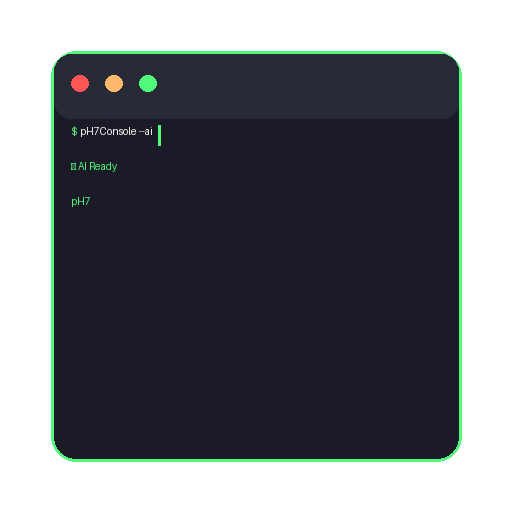

# pH7Console: AI-Powered Terminal



A privacy-first terminal built with Tauri that runs AI models locally — no telemetry, no cloud, no data leaving your machine.

## Features

- **Natural Language Commands** — Type plain English; get shell commands
- **Smart Completions** — Context-aware suggestions as you type (Tab)
- **Error Assistance** — AI automatically suggests fixes when commands fail
- **Local LLM Support** — Runs Phi-3 Mini, Llama 3.2, TinyLlama, or CodeQwen locally
- **Pattern Learning** — Learns your workflows and adapts suggestions over time
- **Multi-Session** — Multiple terminal sessions with `Cmd+T`

## Requirements

- **Rust** 1.70+ — [rustup.rs](https://rustup.rs/)
- **Node.js** 18+ — [nodejs.org](https://nodejs.org/)
- **RAM** 4GB minimum (8GB recommended for AI models)
- **Storage** ~5GB free (for models and dependencies)

## Install & Run

```bash
git clone https://github.com/EfficientTools/pH7Console.git
cd pH7Console
chmod +x setup.sh && ./setup.sh
npm run tauri dev
```

## Build

```bash
# Production build
npm run tauri build

# Universal macOS binary (Intel + Apple Silicon)
npm run tauri build -- --target universal-apple-darwin
```

Build outputs land in `src-tauri/target/release/bundle/`.

## Development

```bash
npm run lint                   # TypeScript/React linting
npm run type-check             # TypeScript type checking
npm test                       # Frontend tests
cd src-tauri && cargo test     # Rust backend tests
cd src-tauri && cargo fmt      # Format Rust code
cd src-tauri && cargo clippy   # Lint Rust code
npm run test:e2e               # Integration tests
```

## Tech Stack

- **Frontend**: React 18 + TypeScript + Tailwind CSS
- **Backend**: Rust + Tauri 2.0
- **AI Runtime**: Candle (Rust-native ML framework)
- **Terminal**: xterm.js + cross-platform PTY

## Author

[](https://ph7.me "Pierre-Henry Soria, Software Developer")

Made with ❤️ by **[Pierre-Henry Soria](https://pierrehenry.be)**. A super passionate & enthusiastic problem-solver engineer. Also a true cheese 🧀, ristretto ☕️, and dark chocolate lover! 😋

[](https://x.com/phenrysay "Follow Me on X") [](https://github.com/pH-7 "My GitHub") [](https://bsky.app/profile/pierrehenry.dev "Follow Me on BlueSky") [](https://www.youtube.com/@pH7Programming "My Channel, NextGen Dev: AI & Code")

## License

**pH7Console** is generously distributed under [MIT](LICENSE.md) license 🎉 Wish you happy, happy productive time! 🤠
