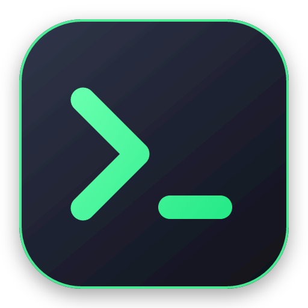

# pH7Console: Private, Intelligent Command Console



A privacy-first macOS command console built with Tauri. Its bundled local model, natural-language command matching, contextual suggestions, and adaptive workflow intelligence run locally: there is no telemetry, cloud account, or remote AI service.

## Usage

Run normal shell commands, including quoted arguments, pipelines, and redirects, or describe common tasks naturally:

```
"show me all large files"  →  find . -type f -size +100M -exec ls -lh {} \;
"what's using the most CPU?"  →  top -o cpu
"check git status and stage changes"  →  git status && git add .
```

Choose a workspace with the system folder picker before working with project files. This explicit choice is required by the Mac App Store sandbox and keeps file access under your control.

## Features

- **Shell-compatible execution** — Supports pipelines, redirects, expansion, and quoted paths through your login shell
- **Natural-language commands** — Translates supported plain-English requests into common shell operations
- **Smart completions** — Offers contextual suggestions as you type
- **Error assistance** — Turns common failures into practical next steps
- **Private workflow adaptation** — Learns from redacted completions in memory and rebuilds adaptive state from encrypted local history on launch
- **Multi-session workspace** — Keeps independent persistent shells and working directories in separate tabs
- **Fast recovery** — Restarts an exited shell in the same workspace without sacrificing the existing tab until its replacement is ready
- **Encrypted searchable history** — Stores bounded, redacted execution metadata in SQLCipher with its key protected by the macOS Keychain
- **Accessible desktop layout** — Keyboard shortcuts, labelled controls, and collapsible side panels

## Requirements

- **Rust** 1.88+ — [rustup.rs](https://rustup.rs/)
- **Node.js** 18+ — [nodejs.org](https://nodejs.org/)
- **macOS** 13.3 or later for the supported desktop release

## Install & Run

```bash
git clone https://github.com/EfficientTools/pH7Console.git
cd pH7Console
chmod +x setup.sh && ./setup.sh
npm run tauri:dev
```

## Build

```bash
# Production build
npm run tauri build

# Universal macOS binary (Intel + Apple Silicon)
npm run tauri build -- --target universal-apple-darwin
```

Build outputs land in `src-tauri/target/release/bundle/`.

For a sandboxed, signed Mac App Store package, follow [APP_STORE_RELEASE.md](APP_STORE_RELEASE.md). The store build deliberately uses user-selected workspace access; an unrestricted terminal product should be distributed separately with Developer ID signing and notarization.

## Development

```bash
npm run lint                   # TypeScript/React linting
npm run type-check             # TypeScript type checking
npm run test:unit              # Frontend unit tests
npm run test:integration       # Desktop UI checks in Chromium and WebKit
npm run test:rust              # Rust backend tests
cd src-tauri && cargo fmt      # Format Rust code
cd src-tauri && cargo clippy   # Lint Rust code
npm run test:ci                # Full release-quality verification
```

## Local intelligence

The current release bundles a compact Qwen2.5-Coder model and runs it through a verified loopback-only llama.cpp helper. The deterministic pattern engine remains available while the model warms, after cancellation, or if local inference is unavailable. Command-derived adaptive state remains in memory; on launch it is rebuilt from bounded, redacted execution metadata in the SQLCipher-encrypted history database. That database's random key is protected by the macOS Keychain. Clearing history also clears adaptive memory, and there is no cloud fallback.

## Tech Stack

- **Frontend**: React 18 + TypeScript + Tailwind CSS
- **Backend**: Rust + Tauri 2.0
- **Local intelligence**: bundled Qwen inference, Rust pattern matching, contextual scoring, cancellable generation, and encrypted-history-backed workflow adaptation
- **Command execution**: The user's login shell, scoped to the selected workspace in the App Store edition

## Author

[](https://ph7.me "Pierre-Henry Soria, Software Developer")

Made with ❤️ by **[Pierre-Henry Soria](https://pierrehenry.be)**. A super passionate & enthusiastic problem-solver engineer. Also a true cheese 🧀, ristretto ☕️, and dark chocolate lover! 😋

[](https://x.com/phenrysay "Follow Me on X") [](https://github.com/pH-7 "My GitHub") [](https://bsky.app/profile/pierrehenry.dev "Follow Me on BlueSky") [](https://www.youtube.com/@pH7Programming "My Channel, NextGen Dev: AI & Code")

## License

**pH7Console** is generously distributed under [MIT](LICENSE.md) license 🎉 Wish you happy, happy productive time! 🤠
